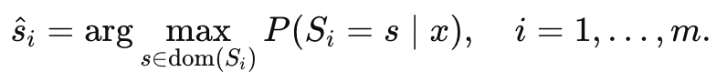
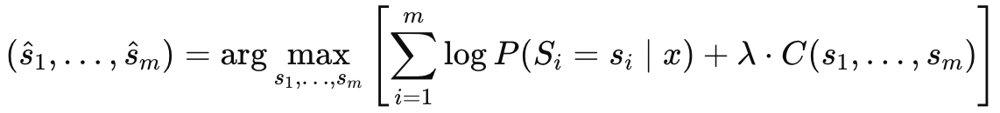
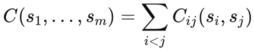

# Methodological improvement

## 0 Motivation

In our original method of independent decoding(decoding mask token for each attribute sequentially), the predicted attribute may be incompatible(e.g. High-end CPU is not compatible with low memory RAM). However, the original independent decoding method cannot tackle this incompatibility issue properly. Therefore, we propose a novel idea of constraint-aware joint decoding to deal with the incompatibility issue among attributes.

---

## 1 Method idea: Constraint-aware joint decoding for compatible specification inference

While the prompt-guided LoRA-fine-tuned LLM described above is effective at predicting individual product specifications, directly selecting the most probable value for each attribute independently may lead to suboptimal or incompatible configurations. In real-world mass customization settings, product attributes are not independent; instead, they exhibit strong interdependencies governed by functional, performance, and engineering constraints. For example, high-resolution displays typically require more powerful graphics hardware, and high-performance computing tasks demand coordinated upgrades across processors, memory, and storage. Ignoring such interdependencies may result in technically infeasible or poorly balanced product recommendations.

To address this issue, we introduce a **constraint-aware joint decoding module** that explicitly incorporates cross-attribute compatibility into the inference process. Rather than selecting specifications independently via per-attribute maximum likelihood estimation, our approach formulates choice navigation as a **joint inference problem** over all product attributes, balancing linguistic alignment with domain-specific compatibility.

---

### 1.1 Independent decoding versus joint decoding

Given a customer needs expression `x`, the prompt-guided LLM produces a predictive distribution for each product attribute `S_i`, denoted as `P(S_i | x)`.
A standard inference strategy selects the final specification for each attribute independently as:

* `ŝ_i = argmax_{s ∈ dom(S_i)} P(S_i = s | x)`, for `i = 1, ..., m`


While computationally efficient, this independent decoding strategy does not account for dependencies among attributes and may yield incompatible combinations.

In contrast, we propose a **joint decoding strategy** that selects the optimal configuration across all attributes simultaneously. Specifically, we infer the specification tuple `(s_1, ..., s_m)` that maximizes a combined objective consisting of the LLM likelihood and an explicit compatibility score:

* `(ŝ_1, ..., ŝ_m) = argmax_{s_1, ..., s_m} [ Σ_{i=1}^m log P(S_i = s_i | x) + λ · C(s_1, ..., s_m) ]`


where:

* `C(s_1, ..., s_m)` is a compatibility function capturing cross-attribute constraints
* `λ` is a hyperparameter controlling the influence of compatibility relative to linguistic likelihood

---

### 1.2 Explicit compatibility modeling

The compatibility function `C(·)` encodes domain knowledge regarding feasible and well-balanced product configurations. In this work, we model compatibility at the **pairwise attribute level**, which provides a good trade-off between expressiveness and computational efficiency. The compatibility score is defined as:

* `C(s_1, ..., s_m) = Σ_{i < j} C_ij(s_i, s_j)`


where `C_ij(s_i, s_j)` measures the compatibility between the selected values of attributes `S_i` and `S_j`.

The pairwise compatibility scores `C_ij` can be constructed in two complementary ways:

1. **Data-driven compatibility**
   Compatibility scores are derived from empirical co-occurrence statistics in the training dataset. Frequently observed attribute combinations receive higher scores, while rare or unseen combinations are penalized.

2. **Rule-based constraints**
   Domain knowledge is used to encode engineering or performance requirements, such as minimum memory thresholds for high-end processors or incompatibilities between integrated graphics and ultra-high-resolution displays.

In practice, these two approaches can be combined to improve both robustness and interpretability.

---

### 1.3 Efficient inference with constrained decoding

To ensure computational efficiency, especially given the limited number of discrete specification categories, we perform constrained decoding over a reduced candidate space. For each attribute `S_i`, we retain the top-`K` candidates according to `P(S_i | x)`. The Cartesian product of these candidate sets yields a manageable number of candidate configurations.

Each candidate configuration is then scored using the joint objective defined above, and the configuration with the highest score is selected as the final recommendation.

This constrained decoding procedure introduces minimal overhead while significantly improving the technical coherence of the predicted configurations. Importantly, the compatibility-aware joint decoding module operates entirely at inference time and does not require any modification to the prompt design, LoRA fine-tuning process, or ensemble strategy described in previous sections.

---

### 1.4 Discussion

By explicitly modeling cross-attribute compatibility, the proposed joint decoding strategy bridges the gap between language-based intent understanding and engineering feasibility. It enhances the reliability of LLM-based choice navigation systems by ensuring that recommended configurations are not only aligned with customer needs expressed in natural language but also consistent with real-world manufacturing constraints. This integration of data-driven language modeling with structured domain knowledge is particularly valuable in mass customization settings, where infeasible or poorly balanced recommendations may lead to user dissatisfaction, increased return rates, or additional design iterations.

---

## 2 Illustration of new method with example

### 2.1 Example: High-performance workload with insufficient memory

#### 2.1.1 Scenario

Customer says:

> *“I want a laptop for machine learning experiments and large data processing.”*

---

### 2.2 Independent decoding(original method)

The LLM predicts **each attribute independently**:

| Attribute | Classes                 | Log-probabilities                              |
| --------- | ----------------------- | ---------------------------------------------- |
| CPU       | {Low, Mid, High}        | High: **−0.10**, Mid: −1.20, Low: −2.30        |
| RAM       | {8GB, 16GB, 32GB}       | 16GB: **−0.15**, 32GB: −0.40, 8GB: −1.80       |
| GPU       | {Integrated, Mid, High} | High: **−0.20**, Mid: −0.80, Integrated: −2.10 |

#### 2.2.1 Independent argmax result

```
CPU = High
RAM = 16GB
GPU = High
```

#### 2.2.2 Why this is problematic

* High-end CPU + GPU **strongly suggests** 32GB RAM
* 16GB RAM becomes a bottleneck for ML workloads
* The model never checks cross-attribute consistency

---

### 2.3 Constraint-aware joint decoding

#### 2.3.1 Learned compatibility scores

| Pair                 | Score |
| -------------------- | ----- |
| (High CPU, 16GB RAM) | −1.2  |
| (High CPU, 32GB RAM) | +0.8  |
| (High GPU, 16GB RAM) | −1.0  |
| (High GPU, 32GB RAM) | +0.9  |

---

#### 2.3.2 Joint scoring

**Configuration A (independent decoding result: incompatible)**

```
High CPU, 16GB RAM, High GPU
```

```
LLM score = −0.10 − 0.15 − 0.20 = −0.45
Compatibility = −1.2 − 1.0 = −2.2
Total = −0.45 + λ(−2.2) = −2.65   (λ = 1)
```

**Configuration B (balanced alternative: compatible)**

```
High CPU, 32GB RAM, High GPU
```

```
LLM score = −0.10 − 0.40 − 0.20 = −0.70
Compatibility = +0.8 + 0.9 = +1.7
Total = −0.70 + 1.7 = +1.00
```

#### 2.3.3 Final decision

**Constraint-aware joint decoding selects 32GB RAM**, correcting the incompatibility of under-specification.

---

### 2.4 Insights from example

The example clearly show:

| Aspect                 | Independent Decoding     | Constraint-Aware Joint Decoding |
| ---------------------- | ------------------------ | ------------------------- |
| Attribute interactions | Ignored                  | Explicitly modeled        |
| Feasibility            | Not guaranteed           | Enforced                  |
| Error type             | Under-/mis-specification | Corrected                 |
| Manufacturing realism  | Low                      | High                      |

These aspects can be further extended as the section of **qualitative case study**.


---

## 3 Why this is methodological novelty

We move beyond treating choice navigation as independent attribute prediction and instead formulate it as a constraint-aware joint inference problem.

That’s a **problem reformulation**, which is high-value novelty.

---

## 4 Improvement in our storytelling

- **Before**: We fine-tune LLMs to predict specs.

- **Now**: We integrate LLMs with structured domain constraints to ensure predicted configurations are both linguistically aligned and technically feasible.
Unlike prior LLM-based approaches that treat product attributes independently, we explicitly incorporate cross-attribute compatibility constraints into the decoding process, aligning LLM predictions with real-world manufacturability.

---