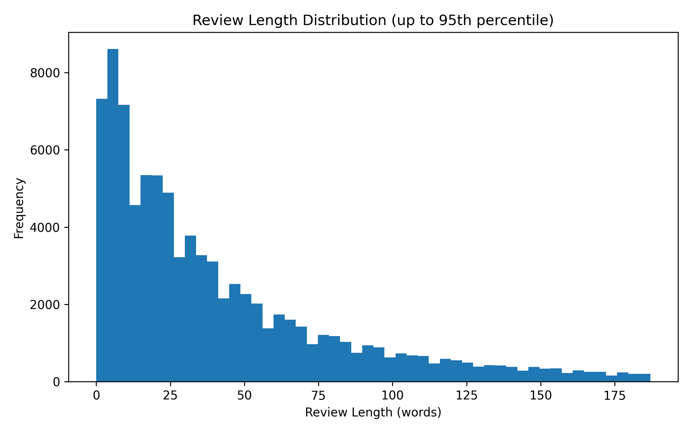

# New Synthesis Method for Needs

## Motivation

Due to the data inconsistency in the original synthesized needs text, the model cannot learn effectively and the testing result cannot reflect how well the model has learned.

In this case, we propose a new synthesis method for needs generation to deal with the challenge of data inconsistency.

## 4-stage synthesis method

### Stage 1: Review length distribution analysis & Filter

Below is the distribution of review length in words.

We decide to filter out the review text with less than 40 words.

**Output file** of stage 1: *reviews_more_than_40_words.csv*.

### Stage 2: Stratified shuffling and spliting

Then we adopt stratified shuffling to the whole dataset consisting of review text with more than 40 words. And we obtain 3000 out of them for later synthesis.

**Output file** of stage 2: *reviews_more_than_40_words_3000_stratified.csv*.

### Stage 3: Extract attribute-related information

**Attempt 1**: List the names of attributes only in the prompts.

- **Result of Attempt 1**: Misunderstanding and hallucination occurs for some unclear attributes such as *Seat Type* and *Weight Range*.

**Attempt 2**: Attach several specification examples for the unclear attributes that need further clarification such as *Seat Type* and *Installation Type*.

- **Result of Attempt 2**: Eliminate the misunderstanding and hallucination to great extent.

**Output file** of stage 3: *reviews_40+_words_strat_shuffle_split_3k.csv*.

### Stage 4: Needs synthesis based on relevant information

If the information describes positive advantages or features, express them directly as customer needs.

**Attempt 1**:
If the information describes problems, complaints, or negative issues, express them as needs that should be fixed, improved, or properly solved.

- **Implication of Attempt 1**:
Inconsistency occurs if the needs fixes/solves the drawbacks or issues corresponding to the negative information. This is because the product actually has the negative drawbacks or issues, so the needs for the product should reflect or admit the drawbacks or issues instead of denying(fixing/solving) it. Denying(fixing/solving) the drawback or issues will lead to mismatch between needs and product.

        Information:{
            Installation Type: Difficult to install using seatbelt
            Harness Type: Secure and adjustable
        }

        - Syntheized needs(mismatched):
        Customers need a child car seat that is easy and intuitive to install using a seatbelt, and that provides a secure and easily adjustable harness for child safety.

**Attempt 2**:
For negative information, express them as customer needs indicating that these issues are acceptable or tolerable.

- **Implication of Attempt 2**:
Eliminate the inconsistency since the needs admits the existence of the drawbacks or issues and states that they are acceptable and tolerable. In this case, the needs can consistently match the product with the negative drawbacks or issues.

        - Information:{
            Installation Type: Difficult to install using seatbelt
            Material: Fabric feels slightly rough
        }

        - Syntheized needs(matched):
        Customers need a child car seat whose installation difficulty using a seatbelt is acceptable, and whose fabric texture is tolerable during everyday use.

**Output file** of stage 3: *processed_reviews_with_needs.csv*.

## Result on dataset from new synthesis method

### Main results

Below is the comparison of the result on old needs dataset and new needs dataset.

|LoRA|old dataset|new dataset|trend|
|---|---|---|---|
|Seat Type|38.4|42.3|+3.9|
|Weight Range|51.5|42.9|-8.6|
|Installation Type|66.5|69.1|+2.6|
|Harness Type|64.0|69.9|+5.9|
|Material|35.2|34.5|-0.7|

|LoRA+ensemble|old dataset|new dataset|trend|
|---|---|---|---|
|Seat Type|39.4|44.6|+5.2|
|Weight Range|51.8|43.2|-8.6|
|Installation Type|67.2|69.2|+2.0|
|Harness Type|65.8|70.0|+4.2|
|Material|36.3|34.6|-1.7|

### Analysis

We observe obvious performance improvement in Seat Type, Installation Type and Harness Type and performance drop in Weight Range. The performance of Material stays almost the same.

To understand the main results, we should interpret them from the data perspective. As we found previously, the data inconsistency prevents model from learning effectively and thus the accuracy of Seat Type and Material is quite low.

With the new synthesis method to generate needs, we extract some attribute-related information and synthesize needs based on the relevant information. Among the relevant information, the proportion of the information about different attributes are different. Below is the occurrence times of different attributes.

||Seat Type|Weight Range|Installation Type|Harness Type|Material|
|---|---|---|---|---|---|
|occurrence times in relevant information|1865|874|1616|932|975|

We notice that the largest proportion corresponds to Seat Type and the smallest proportion corresponds to Weight Range. With the fact that the performance of Seat Type increase and the one of Weight Range decrease, we believe that the relevant information is playing an important role in eliminating the inconsistency among data. This means that the large amount of relevant information about Seat Type has eliminated the inconsistency for Seat Type attribute to some extent. And the Weight Range shows it in the opposite way. 

However, the occurence times of attribute-related information can explain the **trend** of the performance to some extent, but cannot explain **absolute performance**. Actually, that is because the data inconsistency is not completely eliminated. The reasons found include:
- the relevant information is vague and unclear. (For Weight Range, Material)
- the relevant information is similar and undistinguishable. (For Seat Type, Material)
- lack of relevant information. (For Weight Range, Harness Type and Material)
- the relevant information may contradict with the corresponding label. (For Seat Type, Material)
- the task(attribute) itself is undistinguishable from review text. (For Material)

**Conclusion**: In summary, data inconsistency is merely alleviated to some extent via new synthesis method. Actually, data inconsistency still exists in the synthesized needs text dataset and cannot be eliminated completely. In this case, trade-off between data inconsistency and the attribute task performance becomes important, since the complete elimination of data inconsistency is very difficult or even impossible. Therefore, our goal is to alleviate the data inconsistency as much as possible until the attribute task performance is satisfactory.